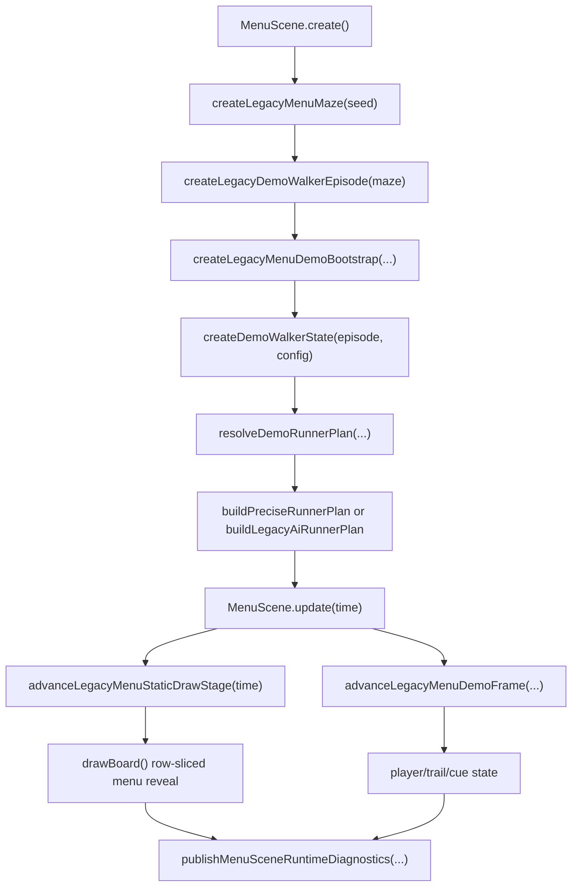

# Mazer Menu Generation And AI Loop Map

Date: 2026-07-02
Status: active owner map
Current 1:1 marker: `92%` unchanged

## Purpose

This map is the first stop before changing the menu maze reveal, menu-demo AI pathing, route cues, or generation diagnostics. It keeps future passes modular so a visual tweak does not accidentally rewrite topology, AI route ownership, or reset flow.

This is a mapping packet only. It does not ratchet the 1:1 marker.

## Runtime Loop

## Owner Surfaces

| Concern | First owner | Downstream surfaces | Proof |
| --- | --- | --- | --- |
| Menu fixed maze shape | `src/legacy-runtime/legacyMaze.ts` | `createLegacyMenuMaze()`, `legacyMenuSnapshot.ts`, `legacyMenuRender.ts` | `tests/reset/legacy-reset.test.ts`, `tests/scenes/menu-render-frame.test.ts` |
| Menu generation stage contract | `src/legacy-runtime/legacyGenerationLifecycle.ts` | process `0/3/4/5/6/7/8`, stage cursor, budget, draw-stage shape | `tests/reset/legacy-generation-lifecycle.test.ts`, `tests/reset/legacy-generation-diagnostics.test.ts` |
| Menu row reveal | `src/scenes/MenuScene.ts` | `armLegacyMenuStaticDrawStage()`, `advanceLegacyMenuStaticDrawStage(time)`, `resolveMenuSceneGenerationDrawStageProgress()` | `tests/reset/legacy-reset.test.ts`, localhost diagnostics |
| Menu AI bootstrap | `src/legacy-runtime/legacyMenuDemoLifecycle.ts` | `createLegacyDemoWalkerEpisode()`, fixed-snapshot preroll, visible stable bootstrap | `tests/reset/legacy-menu-demo-lifecycle.test.ts` |
| Menu AI route plan | `src/domain/ai/demoWalker.ts` | `resolveDemoRunnerPlan()`, `buildPreciseRunnerPlan()`, `buildLegacyAiRunnerPlan()` | `tests/ai/demo-walker.test.ts` |
| Menu AI cues | `src/domain/ai/demoWalker.ts` | `cueOverrides`, `segmentTrailModes`, `resolveSegmentCue()`, `resolveSegmentDelayMs()` | `tests/ai/demo-walker.test.ts`, runtime diagnostics |
| AI reset and regeneration | `src/legacy-runtime/legacyMenuDemoLifecycle.ts` | `createLegacyMenuDemoGoalResetRequest()`, process-8 to process-0 handoff | `tests/reset/legacy-menu-demo-lifecycle.test.ts`, `tests/reset/legacy-reset.test.ts` |
| Browser readback | `src/scenes/menuRuntimeDiagnostics.ts` | `data-mazer-runtime-diagnostics`, stage cursor, draw-stage progress, runner telemetry | `tests/scenes/menu-runtime-diagnostics.test.ts`, `tests/visual/edge-live-check.test.ts` |

## Current AI Shape

The web menu AI has two route modes:

- `buildPreciseRunnerPlan()` follows the canonical path exactly.
- `buildLegacyAiRunnerPlan()` is the restored menu-facing humanized lane.

The humanized lane owns:

- `visited`: restored "already seen" path gate.
- `potentialTiles`: restored queue of valid neighboring floor candidates.
- `pathStack`: restored backtrack spine.
- `passesLegacyAiTilePathCheck()`: rejects one-tile dead spurs that cannot continue toward the end.
- `resolveLegacyAiDirectMove()`: scans unvisited floor neighbors and picks the nearest valid candidate to the end.
- `resolveLegacyAiPotentialTarget()`: selects a target from the potential list when direct movement fails.
- `findFloorPath()`: reconnects wrong-branch recovery to canonical replay through adjacent floor movement.

## Current Generation Shape

Menu generation is intentionally not the same owner as active play generation:

- Menu mode uses the fixed legacy menu snapshot.
- Play mode uses generated active runtime mazes.
- Menu stage `6` draw is row-sliced and cadence-gated so the board can reveal over time.
- Play topology is currently resolved as a browser-safe build before visible draw.
- Exact old engine per-tick process-yield timing is still open.

## Safe Edit Rules

- If changing the visible menu maze shape, start in `legacyMenuSnapshot.ts` or `legacyMenuRender.ts`, not `demoWalker.ts`.
- If changing route behavior, start in `demoWalker.ts`, not `MenuScene.drawBoard()`.
- If changing row reveal timing, start in `MenuScene.advanceLegacyMenuStaticDrawStage(time)` and generation diagnostics.
- If changing menu reset/rebuild, start in `legacyMenuDemoLifecycle.ts` and `legacyGenerationLifecycle.ts`.
- If changing shortcut topology for active play, use `legacyMaze.ts`; do not route that work through the fixed menu snapshot.

## Known Open Gaps

- Exact Unreal blueprint AI cadence remains unrecovered.
- Exact visited-tile color-revert/material timer behavior remains unrecovered.
- Exact engine process-yield timing for generation remains approximated by browser-safe contracts.
- Final screenshot-grade menu material and sprite treatment remain visual work, not AI pathing work.

## Current Best Next Runtime Slices

1. Validate whether the current menu row reveal cadence should stay fixed at one row per gate or be tuned against recovered video/screenshot evidence.
2. Compare `buildLegacyAiRunnerPlan()` telemetry against longer menu soak captures and only then adjust wrong-branch frequency.
3. Keep play shortcut/topology changes isolated in `legacyMaze.ts`; do not mix them into menu fixed-snapshot work.
